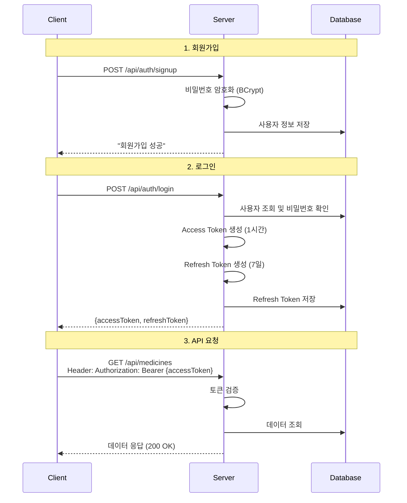
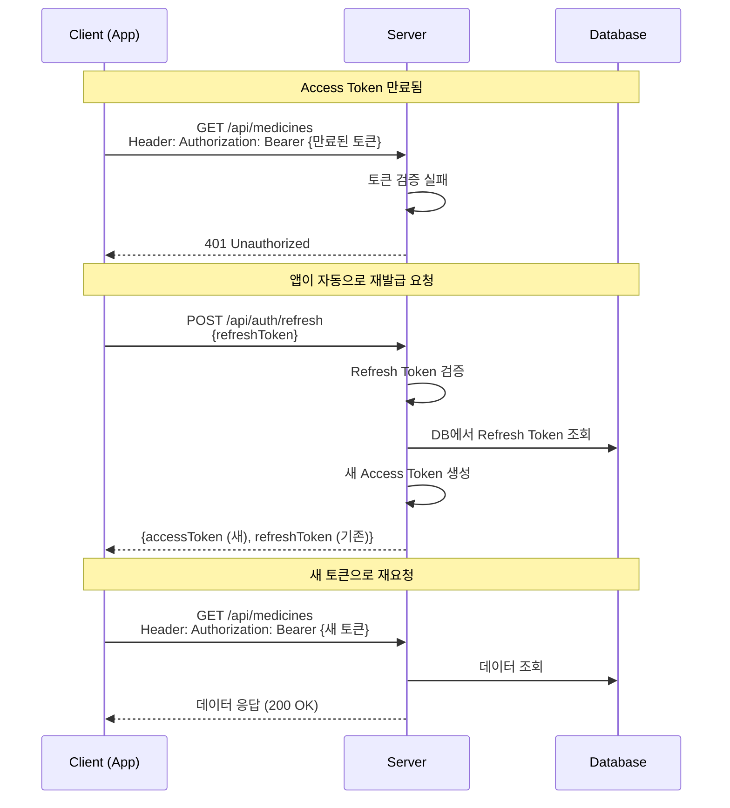

# 🔐 JWT 인증 시스템 학습 프로젝트

Spring Boot로 JWT 토큰 기반 인증 시스템을 **직접 구현**한 학습 프로젝트입니다.  
(Spring Security 없이 순수하게 JWT 동작 원리를 이해하기 위한 프로젝트)

<br>

## 📌 프로젝트 개요

### 핵심 개념
- **Access Token** (짧은 수명): API 요청 시 사용
- **Refresh Token** (긴 수명): Access Token 재발급용
- **비밀번호 암호화** (BCrypt)
- **Stateless 인증** (서버에 세션 저장 안 함)

### 주요 기능
- ✅ 회원가입 (비밀번호 암호화)
- ✅ 로그인 (Access + Refresh Token 발급)
- ✅ JWT 토큰 검증
- ✅ Access Token 재발급 (Refresh Token 사용)
- ✅ 보호된 API 접근 제어

<br>

## 🚀 빠른 시작

### 실행 방법
```bash
# 프로젝트 클론
git clone <repository-url>

# 프로젝트 디렉토리 이동
cd spring-jwt

# 애플리케이션 실행
./gradlew bootRun
```

### 접속 정보
- **서버**: http://localhost:8080
- **H2 Console**: http://localhost:8080/h2-console
  - JDBC URL: `jdbc:h2:mem:pharmacydb`
  - Username: `sa`
  - Password: (공백)

### 테스트 계정
```
사용자 계정
- username: doythan
- password: 1234

관리자 계정
- username: admin
- password: admin1234
```

<br>

## 🏗️ 기술 스택

| 분류 | 기술 |
|------|------|
| **Language** | Java 21 |
| **Framework** | Spring Boot 3.5.8 |
| **Database** | H2 (In-Memory) |
| **ORM** | Spring Data JPA |
| **Security** | JWT (JJWT 0.12.3), BCrypt |
| **Build Tool** | Gradle |

<br>

<details>
<summary><b>📁 프로젝트 구조</b></summary>

```
com.pharmacy.spring_jwt/
├── config/
│   ├── PasswordEncoderConfig.java      # 비밀번호 암호화 설정
│   └── DataInitializer.java            # 테스트 데이터 초기화
│
├── jwt/
│   └── JwtTokenProvider.java           # JWT 생성/검증 핵심 클래스 ⭐
│
├── entity/
│   ├── User.java                       # 사용자 엔티티
│   ├── RefreshToken.java               # Refresh Token 엔티티
│   └── Medicine.java                   # 테스트용 약품 엔티티
│
├── repository/
│   ├── UserRepository.java
│   ├── RefreshTokenRepository.java
│   └── MedicineRepository.java
│
├── dto/
│   ├── AuthRequest.java                # 로그인 요청 DTO
│   ├── AuthResponse.java               # 로그인 응답 DTO
│   ├── SignupRequest.java              # 회원가입 요청 DTO
│   └── TokenRefreshRequest.java        # 토큰 재발급 요청 DTO
│
├── service/
│   ├── AuthService.java                # 인증 비즈니스 로직 ⭐
│   └── MedicineService.java            # 테스트용 서비스
│
└── controller/
    ├── AuthController.java             # 인증 API
    ├── MedicineController.java         # 보호된 API (JWT 필요)
    └── TestController.java             # 공개 API
```

</details>

<details>
<summary><b>⚙️ 설정 파일</b></summary>

### build.gradle
```gradle
plugins {
    id 'java'
    id 'org.springframework.boot' version '3.5.8'
    id 'io.spring.dependency-management' version '1.1.7'
}

group = 'com.pharmacy'
version = '0.0.1-SNAPSHOT'

java {
    toolchain {
        languageVersion = JavaLanguageVersion.of(21)
    }
}

configurations {
    compileOnly {
        extendsFrom annotationProcessor
    }
}

repositories {
    mavenCentral()
}

dependencies {
    implementation 'org.springframework.boot:spring-boot-starter-web'
    implementation 'org.springframework.boot:spring-boot-starter-data-jpa'
    implementation 'com.h2database:h2'
    
    // JWT 라이브러리
    implementation 'io.jsonwebtoken:jjwt-api:0.12.3'
    runtimeOnly 'io.jsonwebtoken:jjwt-impl:0.12.3'
    runtimeOnly 'io.jsonwebtoken:jjwt-jackson:0.12.3'
    
    // 비밀번호 암호화
    implementation 'org.springframework.security:spring-security-crypto:6.2.0'
    
    compileOnly 'org.projectlombok:lombok'
    annotationProcessor 'org.projectlombok:lombok'
    
    testImplementation 'org.springframework.boot:spring-boot-starter-test'
    testRuntimeOnly 'org.junit.platform:junit-platform-launcher'
}

// 인코딩 설정
tasks.named('bootRun') {
    systemProperty 'file.encoding', 'UTF-8'
}

tasks.withType(JavaCompile) {
    options.encoding = 'UTF-8'
}

tasks.named('test') {
    useJUnitPlatform()
}
```

### application.properties
```properties
spring.application.name=spring-jwt

# H2 Database
spring.datasource.url=jdbc:h2:mem:pharmacydb
spring.datasource.driver-class-name=org.h2.Driver
spring.datasource.username=sa
spring.datasource.password=

# H2 Console
spring.h2.console.enabled=true
spring.h2.console.path=/h2-console

# JPA
spring.jpa.hibernate.ddl-auto=create
spring.jpa.show-sql=true
spring.jpa.properties.hibernate.format_sql=true

# JWT 설정
jwt.secret=YourSecretKeyForJWTTokenMustBeLongEnoughAtLeast256BitsForHS256Algorithm
jwt.access-token-validity=3600000      # 1시간 (밀리초)
jwt.refresh-token-validity=604800000   # 7일 (밀리초)
```

</details>

<br>

## 🔐 핵심 코드 설명

### 1. JwtTokenProvider - JWT 생성/검증

JWT 토큰의 생성, 검증, 정보 추출을 담당하는 핵심 클래스입니다.

<details>
<summary><b>코드 보기</b></summary>

```java
@Component
public class JwtTokenProvider {
    
    private final SecretKey secretKey;
    private final long accessTokenValidity;
    private final long refreshTokenValidity;
    
    public JwtTokenProvider(
            @Value("${jwt.secret}") String secret,
            @Value("${jwt.access-token-validity}") long accessTokenValidity,
            @Value("${jwt.refresh-token-validity}") long refreshTokenValidity) {
        this.secretKey = Keys.hmacShaKeyFor(secret.getBytes(StandardCharsets.UTF_8));
        this.accessTokenValidity = accessTokenValidity;
        this.refreshTokenValidity = refreshTokenValidity;
    }
    
    // Access Token 생성
    public String createAccessToken(String username, String role) {
        Date now = new Date();
        Date validity = new Date(now.getTime() + accessTokenValidity);
        
        return Jwts.builder()
                .subject(username)           // 토큰 주인
                .claim("role", role)         // 권한 정보
                .issuedAt(now)              // 발급 시간
                .expiration(validity)        // 만료 시간
                .signWith(secretKey)         // 서명
                .compact();
    }
    
    // Refresh Token 생성
    public String createRefreshToken(String username) {
        Date now = new Date();
        Date validity = new Date(now.getTime() + refreshTokenValidity);
        
        return Jwts.builder()
                .subject(username)
                .issuedAt(now)
                .expiration(validity)
                .signWith(secretKey)
                .compact();
    }
    
    // 토큰 유효성 검증
    public boolean validateToken(String token) {
        try {
            getClaims(token);
            return true;
        } catch (JwtException | IllegalArgumentException e) {
            return false;
        }
    }
    
    // 토큰에서 username 추출
    public String getUsername(String token) {
        return getClaims(token).getSubject();
    }
    
    // 토큰에서 role 추출
    public String getRole(String token) {
        return getClaims(token).get("role", String.class);
    }
    
    // 토큰 파싱
    private Claims getClaims(String token) {
        return Jwts.parser()
                .verifyWith(secretKey)
                .build()
                .parseSignedClaims(token)
                .getPayload();
    }
}
```

**주요 메서드:**
- `createAccessToken()`: username과 role을 담은 짧은 수명 토큰 생성
- `createRefreshToken()`: username만 담은 긴 수명 토큰 생성
- `validateToken()`: 토큰 유효성 검증 (서명, 만료시간 확인)
- `getUsername()`, `getRole()`: 토큰에서 정보 추출

</details>

### 2. AuthService - 인증 비즈니스 로직

회원가입, 로그인, 토큰 재발급 로직을 처리합니다.

<details>
<summary><b>코드 보기</b></summary>

```java
@Service
@RequiredArgsConstructor
public class AuthService {
    
    private final UserRepository userRepository;
    private final RefreshTokenRepository refreshTokenRepository;
    private final JwtTokenProvider jwtTokenProvider;
    private final PasswordEncoder passwordEncoder;
    
    @Value("${jwt.refresh-token-validity}")
    private long refreshTokenValidity;
    
    // 회원가입
    @Transactional
    public String signup(SignupRequest request) {
        if (userRepository.existsByUsername(request.getUsername())) {
            throw new RuntimeException("이미 존재하는 사용자명입니다.");
        }
        
        User user = User.builder()
                .username(request.getUsername())
                .password(passwordEncoder.encode(request.getPassword()))  // 비밀번호 암호화
                .name(request.getName())
                .email(request.getEmail())
                .role(User.Role.ROLE_USER)
                .build();
        
        userRepository.save(user);
        return "회원가입 성공";
    }
    
    // 로그인
    @Transactional
    public AuthResponse login(AuthRequest request) {
        // 사용자 조회
        User user = userRepository.findByUsername(request.getUsername())
                .orElseThrow(() -> new RuntimeException("사용자를 찾을 수 없습니다."));
        
        // 비밀번호 확인
        if (!passwordEncoder.matches(request.getPassword(), user.getPassword())) {
            throw new RuntimeException("비밀번호가 일치하지 않습니다.");
        }
        
        // Access Token 생성
        String accessToken = jwtTokenProvider.createAccessToken(
                user.getUsername(), 
                user.getRole().name()
        );
        
        // Refresh Token 생성
        String refreshToken = jwtTokenProvider.createRefreshToken(user.getUsername());
        
        // Refresh Token DB 저장 (기존 삭제 후)
        refreshTokenRepository.deleteByUserId(user.getId());
        RefreshToken refreshTokenEntity = RefreshToken.builder()
                .userId(user.getId())
                .token(refreshToken)
                .expiryDate(System.currentTimeMillis() + refreshTokenValidity)
                .build();
        refreshTokenRepository.save(refreshTokenEntity);
        
        return AuthResponse.builder()
                .accessToken(accessToken)
                .refreshToken(refreshToken)
                .username(user.getUsername())
                .role(user.getRole().name())
                .build();
    }
    
    // Access Token 재발급
    @Transactional
    public AuthResponse refreshAccessToken(TokenRefreshRequest request) {
        String refreshToken = request.getRefreshToken();
        
        // Refresh Token 유효성 검증
        if (!jwtTokenProvider.validateToken(refreshToken)) {
            throw new RuntimeException("유효하지 않은 Refresh Token입니다.");
        }
        
        // DB 조회
        RefreshToken storedToken = refreshTokenRepository.findByToken(refreshToken)
                .orElseThrow(() -> new RuntimeException("Refresh Token을 찾을 수 없습니다."));
        
        // 만료 체크
        if (storedToken.isExpired()) {
            refreshTokenRepository.delete(storedToken);
            throw new RuntimeException("Refresh Token이 만료되었습니다.");
        }
        
        // 사용자 조회
        User user = userRepository.findById(storedToken.getUserId())
                .orElseThrow(() -> new RuntimeException("사용자를 찾을 수 없습니다."));
        
        // 새 Access Token 생성
        String newAccessToken = jwtTokenProvider.createAccessToken(
                user.getUsername(), 
                user.getRole().name()
        );
        
        return AuthResponse.builder()
                .accessToken(newAccessToken)
                .refreshToken(refreshToken)  // Refresh Token은 그대로
                .username(user.getUsername())
                .role(user.getRole().name())
                .build();
    }
}
```

**핵심 로직:**
1. **회원가입**: 비밀번호 BCrypt 암호화 후 DB 저장
2. **로그인**: 비밀번호 검증 → Access + Refresh Token 생성 → Refresh Token DB 저장
3. **토큰 재발급**: Refresh Token 검증 → DB 조회 → 새 Access Token 발급

</details>

### 3. MedicineController - JWT 보호된 API

토큰 검증 후에만 접근 가능한 보호된 API입니다.

<details>
<summary><b>코드 보기</b></summary>

```java
@RestController
@RequestMapping("/api/medicines")
@RequiredArgsConstructor
public class MedicineController {
    
    private final MedicineService medicineService;
    private final JwtTokenProvider jwtTokenProvider;
    
    @GetMapping
    public ResponseEntity<?> getAllMedicines(
            @RequestHeader(value = "Authorization", required = false) String authHeader) {
        
        // 1. 토큰 존재 여부 확인
        if (authHeader == null || !authHeader.startsWith("Bearer ")) {
            return ResponseEntity.status(401).body("인증 토큰이 필요합니다.");
        }
        
        // 2. "Bearer " 접두사 제거
        String token = authHeader.substring(7);
        
        // 3. 토큰 유효성 검증
        if (!jwtTokenProvider.validateToken(token)) {
            return ResponseEntity.status(401).body("유효하지 않은 토큰입니다.");
        }
        
        // 4. 토큰에서 사용자 정보 추출 (필요시 사용)
        String username = jwtTokenProvider.getUsername(token);
        String role = jwtTokenProvider.getRole(token);
        
        System.out.println("요청 사용자: " + username + ", 권한: " + role);
        
        // 5. 비즈니스 로직 실행
        List<Medicine> medicines = medicineService.getAllMedicines();
        return ResponseEntity.ok(medicines);
    }
}
```

**토큰 검증 흐름:**
1. `Authorization` 헤더 확인
2. `Bearer ` 접두사 제거
3. `validateToken()`으로 유효성 검증
4. 유효하면 비즈니스 로직 실행
5. 무효하면 401 Unauthorized 반환

</details>

<br>

## 🔄 전체 동작 플로우

### 1. 회원가입 → 로그인 → API 요청



### 2. Access Token 만료 → 자동 재발급



<br>

## 📡 API 명세

### 인증 API

#### 1. 회원가입
```http
POST /api/auth/signup
Content-Type: application/json

{
    "username": "testuser",
    "password": "test1234",
    "name": "테스트유저",
    "email": "test@test.com"
}
```

**응답 (200 OK)**
```
회원가입 성공
```

---

#### 2. 로그인
```http
POST /api/auth/login
Content-Type: application/json

{
    "username": "doythan",
    "password": "1234"
}
```

**응답 (200 OK)**
```json
{
    "accessToken": "eyJhbGciOiJIUzI1NiJ9...",
    "refreshToken": "eyJhbGciOiJIUzI1NiJ9...",
    "username": "doythan",
    "role": "ROLE_USER"
}
```

---

#### 3. Access Token 재발급
```http
POST /api/auth/refresh
Content-Type: application/json

{
    "refreshToken": "eyJhbGciOiJIUzI1NiJ9..."
}
```

**응답 (200 OK)**
```json
{
    "accessToken": "eyJhbGciOiJIUzI1NiJ9... (새 토큰)",
    "refreshToken": "eyJhbGciOiJIUzI1NiJ9... (기존 토큰)",
    "username": "doythan",
    "role": "ROLE_USER"
}
```

---

### 보호된 API (JWT 필요)

#### 4. 약품 목록 조회
```http
GET /api/medicines
Authorization: Bearer {accessToken}
```

**응답 (200 OK)**
```json
[
    {
        "id": 1,
        "name": "Tylenol",
        "manufacturer": "Johnson & Johnson Korea",
        "stock": 100,
        "price": 5000
    },
    {
        "id": 2,
        "name": "Gevolin",
        "manufacturer": "Samjin Pharm",
        "stock": 50,
        "price": 3000
    }
]
```

**에러 응답 (401 Unauthorized)**
```
인증 토큰이 필요합니다.
```
또는
```
유효하지 않은 토큰입니다.
```

---

#### 5. 약품 상세 조회
```http
GET /api/medicines/{id}
Authorization: Bearer {accessToken}
```

**응답 (200 OK)**
```json
{
    "id": 1,
    "name": "Tylenol",
    "manufacturer": "Johnson & Johnson Korea",
    "stock": 100,
    "price": 5000
}
```

---

### 공개 API (JWT 불필요)

#### 6. 테스트 엔드포인트
```http
GET /api/test/public
```

**응답 (200 OK)**
```
누구나 접근 가능한 API입니다!
```

<br>

## 🧪 테스트 방법

### Postman 사용

1. **로그인**
   - POST `http://localhost:8080/api/auth/login`
   - Body (JSON): `{"username": "doythan", "password": "1234"}`
   - `accessToken` 값 복사

2. **약품 조회 (인증 필요)**
   - GET `http://localhost:8080/api/medicines`
   - Headers 추가: `Authorization: Bearer {복사한_accessToken}`

3. **토큰 재발급**
   - POST `http://localhost:8080/api/auth/refresh`
   - Body (JSON): `{"refreshToken": "{로그인_시_받은_refreshToken}"}`

### curl 사용

```bash
# 로그인
curl -X POST http://localhost:8080/api/auth/login \
-H "Content-Type: application/json" \
-d '{"username": "doythan", "password": "1234"}'

# 약품 조회 (토큰 필요)
curl -X GET http://localhost:8080/api/medicines \
-H "Authorization: Bearer {accessToken}"

# 토큰 재발급
curl -X POST http://localhost:8080/api/auth/refresh \
-H "Content-Type: application/json" \
-d '{"refreshToken": "{refreshToken}"}'
```

<br>

## 💡 주요 개념 정리

### JWT 구조
```
eyJhbGciOiJIUzI1NiJ9.eyJzdWIiOiJkb3l0aGFuIn0.xxxxx
└─────── Header ──────┘ └──── Payload ────┘ └─ Signature ─┘
```

- **Header**: 알고리즘 정보 (HS256)
- **Payload**: 데이터 (username, role, 만료시간 등)
- **Signature**: 위변조 방지 서명

### Access Token vs Refresh Token

| 구분 | Access Token | Refresh Token |
|------|-------------|---------------|
| **용도** | API 요청 인증 | Access Token 재발급 |
| **수명** | 짧음 (15분~1시간) | 길음 (2주~1개월) |
| **저장** | 클라이언트만 | 클라이언트 + DB |
| **포함 정보** | username, role | username만 |
| **탈취 위험** | 낮음 (금방 만료) | 높음 (오래 유효) |

### 왜 2개의 토큰을 사용할까?

**보안과 편의성의 균형**
- Access Token만 사용 시: 탈취되면 오래 사용 가능 (위험)
- 2개 사용 시: Access는 짧게 (보안 ↑), Refresh로 자동 재발급 (편의성 ↑)

### Spring Data JPA 메서드 네이밍

메서드 이름만으로 SQL 쿼리가 자동 생성됩니다!

```java
// SELECT * FROM users WHERE username = ?
Optional<User> findByUsername(String username);

// SELECT COUNT(*) FROM users WHERE username = ?
boolean existsByUsername(String username);

// DELETE FROM users WHERE user_id = ?
void deleteByUserId(Long userId);

// SELECT * FROM users WHERE name LIKE %?%
List<User> findByNameContaining(String keyword);
```

<br>

## 🔧 실무 적용 팁

### 1. 만료 시간 설정 가이드

```properties
# 보안 중요 (금융/의료)
jwt.access-token-validity=900000       # 15분
jwt.refresh-token-validity=604800000   # 7일

# 일반 업무용
jwt.access-token-validity=3600000      # 1시간
jwt.refresh-token-validity=1209600000  # 2주

# 편의성 중시 (SNS)
jwt.access-token-validity=86400000     # 24시간
jwt.refresh-token-validity=2592000000  # 30일
```

### 2. 로그아웃 구현

```java
@PostMapping("/logout")
public ResponseEntity<String> logout(
        @RequestHeader("Authorization") String authHeader) {
    
    String token = authHeader.substring(7);
    String username = jwtTokenProvider.getUsername(token);
    
    User user = userRepository.findByUsername(username)
            .orElseThrow(() -> new RuntimeException("사용자를 찾을 수 없습니다."));
    
    // DB에서 Refresh Token 삭제 → 재발급 불가능
    refreshTokenRepository.deleteByUserId(user.getId());
    
    return ResponseEntity.ok("로그아웃 성공");
}
```

### 3. 여러 기기 동시 로그인 허용

현재는 로그인 시 기존 토큰을 삭제하므로, 마지막 로그인한 기기만 유효합니다.

```java
// 현재 코드
refreshTokenRepository.deleteByUserId(user.getId());  // 기존 토큰 삭제

// 여러 기기 허용하려면
@Entity
public class RefreshToken {
    private Long userId;
    private String token;
    private String deviceId;  // 기기 식별자 추가!
    private Long expiryDate;
}
```

### 4. Rolling Refresh Token (보안 강화)

재발급 시 Refresh Token도 새로 발급하여 보안을 강화합니다.

```java
public AuthResponse refreshAccessToken(TokenRefreshRequest request) {
    // ... 검증 로직 ...
    
    String newAccessToken = jwtTokenProvider.createAccessToken(...);
    String newRefreshToken = jwtTokenProvider.createRefreshToken(...);  // 새로 발급!
    
    // DB 업데이트
    storedToken.updateToken(newRefreshToken);
    
    return AuthResponse.builder()
            .accessToken(newAccessToken)
            .refreshToken(newRefreshToken)  // 둘 다 새 토큰!
            .build();
}
```

<br>

## 🚀 다음 단계

### 1. Spring Security 통합
현재는 직접 구현했지만, 실무에서는 Spring Security를 사용합니다.
- Filter Chain으로 자동 토큰 검증
- 권한별 접근 제어 (`@PreAuthorize("hasRole('ADMIN')")`)
- CSRF, CORS 보안 설정

### 2. 실제 DB 연동 (MSSQL)
H2 대신 실제 데이터베이스를 사용합니다.
```properties
spring.datasource.url=jdbc:sqlserver://서버:1433;databaseName=pharmacy
spring.datasource.username=sa
spring.datasource.password=your_password
spring.jpa.hibernate.ddl-auto=validate  # 실무에서는 validate 사용
```

### 3. 예외 처리 강화
```java
@RestControllerAdvice
public class GlobalExceptionHandler {
    
    @ExceptionHandler(RuntimeException.class)
    public ResponseEntity<ErrorResponse> handleRuntimeException(RuntimeException e) {
        return ResponseEntity.badRequest()
                .body(new ErrorResponse(e.getMessage()));
    }
    
    @ExceptionHandler(JwtException.class)
    public ResponseEntity<ErrorResponse> handleJwtException(JwtException e) {
        return ResponseEntity.status(401)
                .body(new ErrorResponse("토큰이 유효하지 않습니다."));
    }
}
```

### 4. 테스트 코드 작성
```java
@SpringBootTest
class AuthServiceTest {
    
    @Autowired
    private AuthService authService;
    
    @Test
    void 로그인_성공_테스트() {
        // given
        AuthRequest request = new AuthRequest();
        request.setUsername("doythan");
        request.setPassword("1234");
        
        // when
        AuthResponse response = authService.login(request);
        
        // then
        assertNotNull(response.getAccessToken());
        assertEquals("doythan", response.getUsername());
        assertEquals("ROLE_USER", response.getRole());
    }
    
    @Test
    void 잘못된_비밀번호_로그인_실패_테스트() {
        // given
        AuthRequest request = new AuthRequest();
        request.setUsername("doythan");
        request.setPassword("wrong_password");
        
        // when & then
        assertThrows(RuntimeException.class, () -> {
            authService.login(request);
        });
    }
}
```

<br>

## 📚 참고 자료

- [JWT 공식 사이트](https://jwt.io/)
- [JJWT 라이브러리 GitHub](https://github.com/jwtk/jjwt)
- [Spring Data JPA 공식 문서](https://docs.spring.io/spring-data/jpa/docs/current/reference/html/)
- [Spring Boot 공식 문서](https://docs.spring.io/spring-boot/docs/current/reference/html/)

<br>

## 📝 라이센스

이 프로젝트는 학습 목적으로 제작되었습니다.

<br>

## 👨‍💻 개발자

**Doythan**
- 제약 도매 회사 주니어 개발자
- Spring Boot & JWT 학습 중

---

**⭐ 이 프로젝트가 도움이 되셨다면 Star를 눌러주세요!**